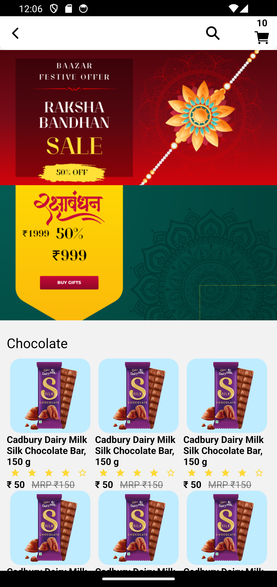

# E-Commerce App

Welcome to the E-Commerce App! This app is a fully functional e-commerce platform designed to provide users with a seamless online shopping experience. Built with modern technologies, the app supports features like product browsing, cart management, order placement, and more.

---

## Features

### User Features:
- **User Authentication:** Secure user registration and login.
- **Product Browsing:** Explore products by category, price, and popularity.
- **Search Functionality:** Quickly find products with an advanced search bar.
- **Shopping Cart:** Add, remove, or update product quantities in the cart.
- **Order History:** View past orders and their statuses.
- **Wishlist:** Save products for later purchases.


## Technologies Used
-firebase Auth
-React Native
-firestore

### Frontend:
- React Native


## Installation

1. **Clone the Repository:**
   ```bash
   git clone https://github.com/yourusername/ecommerce-app.git
   ```

2. **Install Dependencies:**
   ```bash
   npm i or npm install
   ```


4. **Start the App:**
   - Start in Andrid:
     ```bash
     npm run android
     ```

5. **Access the App:**
   Open your mobile device emulator or connect a physical device to see the app running.

---

## Screenshots

### Home Page:


### Product Page:


### Cart :


## Contribution

We welcome contributions to enhance the app! Follow these steps to contribute:
1. Fork the repository.
2. Create a new branch for your feature/bugfix:
   ```bash
   git checkout -b feature-name
   ```
3. Commit your changes:
   ```bash
   git commit -m "Description of your changes"
   ```
4. Push to your branch and create a pull request.

---

## License

This project is licensed under the MIT License. See the LICENSE file for more details.

---

## Contact

For any questions or feedback, feel free to contact us at:
- Email: itzmohitsharma20@gmail.com

Thank you for using the E-Commerce App!

